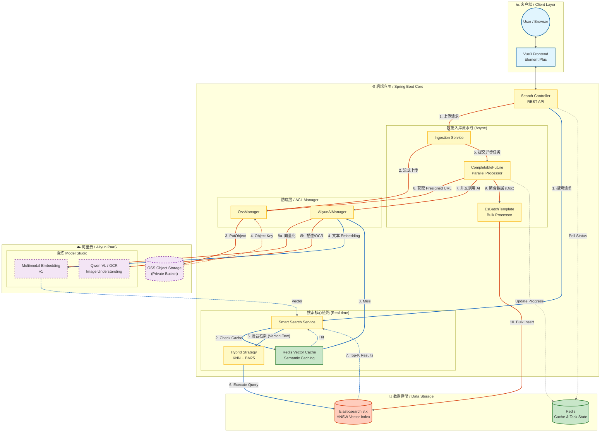

# 🌌 SmartVision: 企业级多模态混合检索引擎

> **项目定位：** 基于 **Elasticsearch 8** 与 **阿里云通义大模型** 构建的下一代语义搜索引擎。
> **核心能力：** 融合 **视觉理解 (Vector)** 与 **文本识别 (OCR)**，实现“所想即所得”的搜索体验。

---

## 1. 项目背景与业务痛点 (Background)

在传统的企业内容管理（DAM）或电商场景中，非结构化数据（图片/扫描件）的检索一直存在两大瓶颈：
1.  **语义鸿沟：** 传统搜索依赖文件名或人工标签。用户搜索“雨后的森林”，无法召回文件名为 `IMG_2024.jpg` 的图片。
2.  **文字盲区：** 视觉模型（如 CLIP）擅长理解画面，但无法精准识别图片中的文字（如海报上的活动标题、扫描件中的合同编号）。

**本项目构建了一套“双路召回”架构，结合 AI 的视觉理解能力与 OCR 的文字提取能力，实现了对图片内容的全方位索引。**

---

## 2. 系统架构 (System Architecture)

采用 **Cloud-Native（云原生）** 架构设计，Java 后端作为调度核心，利用公有云的弹性 AI 算力与 Elasticsearch 的检索引擎能力。



---

## 3. 技术栈 (Tech Stack)

*   **后端核心：** Java 17, Spring Boot 3.x
*   **检索引擎：** **Elasticsearch 8.11+**
    *   *特性应用：* `dense_vector` (HNSW 索引), `text` (IK 分词), `bool query` (混合检索)
*   **AI 能力底座 (MaaS)：** **阿里云百炼 (Bailian)**
    *   *多模态模型：* 通义万相/通用多模态表征 (中文理解能力优于 OpenAI CLIP)
    *   *OCR：* 阿里云通用文字识别
*   **存储：** 阿里云 OSS (对象存储)
*   **前端：** Vue 3 + Element Plus

---

## 4. 核心功能与亮点 (Key Features)

### 4.1 核心亮点：双路混合召回 (Dual-Path Hybrid Recall)
针对“包含文字的图片”和“纯画面图片”进行**全覆盖检索**。
*   **场景：** 图库中有一张红裙子照片（无字），和一张写着“新款红色裙子上市”的促销海报。
*   **搜索：** 用户输入“红色裙子”。
*   **逻辑：**
    *   **路一（视觉）：** 搜索词向量与红裙子照片的视觉向量高度相似 -> **召回照片**。
    *   **路二（文本）：** 搜索词与海报 OCR 提取的文字进行 BM25 匹配 -> **召回海报**。
*   **结果：** 系统成功返回两张图片，解决了单一模态的漏检问题。

### 4.2 云原生 AI 集成
摒弃了繁重的本地 PyTorch/ONNX 部署模式，通过 SDK 集成阿里云通义大模型。
*   **优势：** 无需维护 GPU 服务器，无需处理 Python 环境依赖，原生支持中文语义（懂成语、古诗、中国文化），开发效率提升 300%。

### 4.3 高性能向量索引
使用 Elasticsearch 的 **HNSW (Hierarchical Navigable Small World)** 图算法构建向量索引，在百万级数据量下实现毫秒级（<100ms）的 KNN 搜索响应。

---

## 5. 核心代码逻辑 (Implementation Details)

### 5.1 索引设计示例 (Index Mapping Example)
设计了支持“向量+全文”的复合索引结构。

```json
{
  "mappings": {
    "properties": {
      "image_embedding": {
        "type": "dense_vector",
        "dims": 1024,          // 适配阿里云模型输出维度
        "index": true,
        "similarity": "cosine" // 余弦相似度
      },
      "ocr_content": {
        "type": "text",
        "analyzer": "ik_max_word", // 中文分词，用于 OCR 文本检索
        "search_analyzer": "ik_smart"
      },
      "url": { "type": "keyword" }
    }
  }
}
```

### 5.2 混合检索策略 (Java Search Logic)
利用 Elasticsearch 的 `should` 语句实现多路评分融合。

```java
// 构建混合查询
NativeQuery query = NativeQuery.builder()
    .withQuery(q -> q.bool(b -> b
        .should(
            // 1. 视觉路：向量相似度搜索
            s -> s.knn(k -> k
                .field("image_embedding")
                .queryVector(queryVector) // 用户输入的文本转成的向量
                .k(20)
                .boost(0.9f) // 视觉权重
            ),
            // 2. 文本路：OCR 内容关键词匹配
            s -> s.match(m -> m
                .field("ocr_content")
                .query(userQuery) // 用户输入的文本
                .boost(1.1f) // 文本权重 (精确匹配优先)
            )
        )
    ))
    .build();
```

---

## 6. 部署与运行 (Getting Started)

### 前置条件
1.  阿里云账号：开通 **OSS**、**百炼 (Model Studio)**、**OCR** 服务。
2.  本地或服务器安装 Docker (用于运行 Elasticsearch)。

### 步骤
1.  **启动 ES 8.x：**
    ```bash
    docker run -d -p 9200:9200 -e "discovery.type=single-node" -e "xpack.security.enabled=false" elasticsearch:8.11.1
    ```
2.  **配置 `application.yml`：**
    ```yaml
    aliyun:
      access-key: "YOUR_AK"
      secret-key: "YOUR_SK"
      bailian-agent-key: "YOUR_AGENT_KEY"
    spring:
      elasticsearch:
        uris: http://localhost:9200
    ```
3.  **启动 Spring Boot 应用。**
4.  **访问前端页面：** `http://localhost:5173`，开始上传图片并体验搜索。

---

## 7. 架构演进思考 (Roadmap)


*   **V1.0 (当前)：** 基于阿里云 API 的快速 MVP。
*   **V2.0 (规划)：** **私有化/边缘计算改造**。
    *   针对敏感数据场景，将推理层下沉。
    *   使用 **ONNX Runtime for Java** 加载量化后的 **Chinese-CLIP** 模型。
    *   引入 **Tesseract** 或 **PaddleOCR** 进行本地 OCR。
    *   实现完全断网环境下的单机部署，降低长期 API 调用成本。
*   **性能优化：**
    *   引入 **Redis** 缓存高频搜索词向量。
    *   针对 ES 实施 **冷热分离**，将老旧图片的向量索引迁移至低成本节点。
