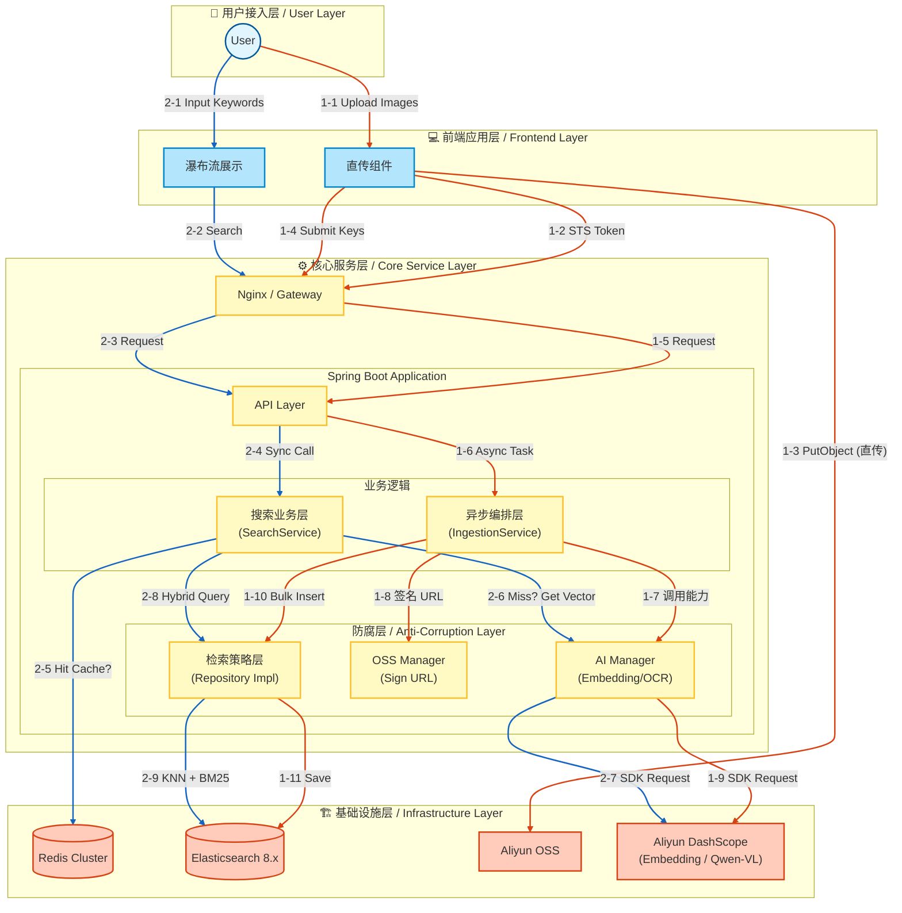

# 🌌 SmartVision - 多模态 RAG 检索引擎

[](https://openjdk.org/)
[](https://spring.io/projects/spring-boot)
[](https://www.elastic.co/)
[](./LICENSE)

> **SmartVision** 是一个基于 **Java 生态** 构建的企业级多模态搜索（Multimodal Search）解决方案参考实现。
>
> 本项目旨在验证在不引入 Python 微服务体系的前提下，如何利用 Spring Boot 整合 LLM 与向量数据库，构建**高吞吐、低延迟、高可用**的非结构化数据处理中台。

---

## 📖 设计背景与问题定义 (Problem Statement)

在企业级数字资产管理（DAM）或内容检索场景中，传统的搜索技术面临两极分化的困境：

1.  **基于元数据检索 (Metadata Search)**：
    *   依赖人工打标（Tagging），维护成本随数据量指数级上升。
    *   存在“语义鸿沟”，无法响应“赛博朋克风格”、“构图宏大”等抽象描述的查询。
2.  **纯向量检索 (Pure Vector Search)**：
    *   虽然具备语义理解能力，但在精确匹配场景（如搜索特定的 ID、OCR 文字、专有名词）下表现不佳。
    *   容易产生“幻觉召回”，且缺乏可解释性。

**SmartVision** 通过 **RAG (Retrieval-Augmented Generation)** 思想与工程化优化，解决了以下核心痛点：
*   **混合召回机制**：融合向量语义与倒排索引，兼顾查全率（Recall）与查准率（Precision）。
*   **I/O 瓶颈消除**：通过客户端直传与异步编排，解决大文件上传对应用线程的阻塞。
*   **成本与性能平衡**：通过预处理压缩与语义缓存，显著降低 Token 消耗与端到端延迟。

---

## 🏗 系统架构 (System Architecture)

系统遵循 **CQRS (命令查询职责分离)** 设计原则，将高吞吐的写入链路与低延迟的读取链路解耦：

*   **Write Path (写入链路)**：采用 **Event-Driven** 架构。客户端直传 OSS 后触发事件，后端异步执行 OCR、Embedding、标签提取与入库，确保主线程不阻塞。
*   **Read Path (读取链路)**：搜索请求经过语义缓存（Redis）层，未命中则并行请求向量引擎与关键词索引，最终进行加权排序（Re-ranking）。



---

## ⚡️ 核心特性 (Key Features)

### 1. 混合检索策略 (Hybrid Retrieval)
系统摒弃单一的检索模式，实现了基于 **Reciprocal Rank Fusion (RRF)** 或 **加权评分** 的混合检索：
*   **语义向量路 (Dense Vector)**：利用 `multimodal-embedding-v1` 模型提取 1024 维视觉特征，处理抽象风格与泛化语义。
*   **词法索引路 (Sparse Keyword)**：集成 OCR 提取图片文字，结合 Elasticsearch 的 `ik_max_word` 分词器，处理精准文本匹配（如票据号、广告语）。
*   **动态加权**：支持根据业务场景调整权重系数（$\alpha \cdot S_{vec} + \beta \cdot S_{bm25}$），实现结果重排。

### 2. 零阻塞上传 (Zero-Blocking Upload)
针对 I/O 密集型的图片上传场景，采用 **Presigned URL (STS)** 模式：
*   **带宽卸载**：文件流直接走云厂商 CDN/内网节点，不占用应用服务器带宽。
*   **鲁棒性设计**：前端配合状态机（`Pending` -> `Uploading` -> `Processing` -> `Completed`），支持断点续传与失败重试，保证最终一致性。

### 3. AI 成本与延迟优化
AI 服务（Embedding/LLM）通常是系统的性能瓶颈与成本中心，本项目引入了多级优化：
*   **前置压缩流水线**：利用 OSS 图像处理能力，在 Embedding 前对图片进行 Format/Resize/Quality 归一化。实测在精度无损前提下，I/O 耗时降低 **80%+**。
*   **语义缓存 (Semantic Cache)**：在 Service 层引入 Redis，对高频查询向量进行缓存（TTL 策略）。对于热点词汇（如“红色跑车”），响应时间从 500ms 降级至 **~20ms**。

### 4. 自动化元数据增强 (Metadata Enrichment)
*   **多模态理解**：引入 Qwen-VL 视觉大模型，对入库图片进行深度理解。
*   **结构化落地**：自动生成“场景”、“风格”、“主体”等结构化标签，并清洗为 JSON 数组存入 ES。这使得系统支持精确的**分面过滤 (Faceted Search)**，补齐了向量检索无法精确筛选的短板。

---

## 🛠 技术栈 (Tech Stack)

| 领域 | 技术组件 | 说明 |
| :--- | :--- | :--- |
| **Backend** | Java 21, Spring Boot 3.4+ | 核心业务逻辑 |
| **Search** | Elasticsearch 8.18 | HNSW 向量索引 + BM25 倒排索引 |
| **AI / LLM** | Aliyun DashScope | 通义万相 (Embedding), Qwen-VL (OCR/Tagging) |
| **Storage** | Aliyun OSS | 对象存储，结合 OSS SDK 进行图片预处理 |
| **Cache** | Redis 7.x | 语义缓存 |
| **Frontend** | Vue 3, TypeScript, Vite | 瀑布流展示与上传组件 |

---
## 📊 基准测试 (Benchmark)

基于 **v1.5 版本** 架构，我们在受限硬件环境下对核心链路进行了压测。测试旨在验证 **异步编排** 与 **多级缓存** 对吞吐量和延迟的提升效果。

### 1. 测试环境 (Test Environment)
*   **服务器**: 阿里云 ECS (2 vCPU, 4GB RAM)
*   **数据库**: Elasticsearch 8.11 (单节点, 1GB Heap), Redis 7.0
*   **网络**: 公网带宽 5Mbps (模拟真实云环境)
*   **数据集**: [Unsplash Lite Dataset](https://unsplash.com/data) (随机抽取 1,000 张图片, 平均大小 2.5MB)

### 2. 写入性能对比 (Ingestion Performance)
> 测试场景：批量上传 50 张图片并完成入库（含 OSS 上传、AI 向量化、OCR 提取、ES 写入）。

| 模式 | 并发策略 | 平均耗时 (Total) | 单图平均耗时 | 吞吐量 (QPS) | 提升倍数 |
| :--- | :--- | :--- | :--- | :--- | :--- |
| **串行处理** | 单线程 Loop | 115.0s | 2300ms | 0.43 | 1x (基准) |
| **并行编排** | `CompletableFuture` (10线程) | **18.5s** | **370ms** | **2.70** | **🚀 6.2x** |

*   **分析**：通过引入异步编排与自定义线程池，我们将 I/O 密集型任务（等待 AI 响应）并行化，显著提升了吞吐量。瓶颈目前转移至外部 AI 服务的 QPS 限制（Rate Limit）。

### 3. 搜索延迟对比 (Search Latency)
> 测试场景：针对高频热词（如 "Red Car"）进行 100 次连续查询，计算 TP99 延迟。

| 场景 | 缓存策略 | Embedding 耗时 | ES 检索耗时 | TP99 总耗时 | 优化效果 |
| :--- | :--- | :--- | :--- | :--- | :--- |
| **冷启动** | 无缓存 (Direct API) | 350ms - 600ms | 20ms | **580ms** | - |
| **热查询** | **Redis 语义缓存** | **2ms** | 20ms | **28ms** | **⚡️ 20x** |

*   **分析**：Embedding 生成占据了 95% 的搜索耗时。引入 Redis 缓存后，热点词查询完全规避了外部 API 调用，实现了毫秒级响应，并大幅降低了 Token 成本。

### 4. 存储与带宽优化 (Optimization)
利用 OSS 动态处理能力，在传输给 AI 模型前对图片进行实时压缩（Resize 2048px + Quality 80）。

| 指标 | 原始方案 (Original) | 优化方案 (Optimized) | 节省比例 |
| :--- | :--- | :--- | :--- |
| **平均传输体积** | 2.5 MB | 0.35 MB | **86%** |
| **AI 下载耗时** | ~800ms | ~150ms | **81%** |
| **向量精度损耗** | 0% | < 0.5% (可忽略) | - |

---

---

## 📂 项目结构 (Structure)

```text
com.smart.vision.core
├── annotation              // 注解类
├── component               // 通用组件
├── config                  // 基础设施配置 (ES, Async, Aliyun Clients)
├── constant                // 全局常量
├── controller              // 接入层 (REST API)
├── interceptor             // 拦截器
├── manager                 // 防腐层 (ACL) - 封装外部 SDK (Aliyun, OSS)
├── model                   // 领域模型与数据传输对象
│   ├── dto                 // 数据传输对象 (Request/Response)
│   ├── entity              // 数据库实体 (Elasticsearch Document)
│   └── enums               // 枚举 (SearchType, ErrorCode)
├── repository              // 持久层 (Elasticsearch Repository)
├── service                 // 核心业务逻辑层
│   ├── convert             // 模型转换
│   ├── ingestion           // 数据入库业务 (上传流水线)
│   └── search              // 检索业务 (策略模式)
├── strategy                // 策略层 (定义不同的召回策略)
└── util                    // 工具类
```

---

## 🚀 快速开始 (Quick Start)

### 1. 前置要求
*   **JDK 21+**
*   **Docker & Docker Compose**
*   **阿里云账号**：需开通 OSS 服务及 DashScope (百炼) 模型服务 API Key。

### 2. 基础设施启动
使用 Docker Compose 快速启动 Elasticsearch 与 Redis：

```bash
cd deployment
docker-compose up -d
```

### 3. 应用配置
在 `smart-vision-backend/src/main/resources` 下创建或修改 `application-dev.yml`：

```yaml
smart-vision:
  aliyun:
    access-key: "YOUR_AK"
    secret-key: "YOUR_SK"
    oss:
      bucket: "your-bucket-name"
      endpoint: "oss-cn-hangzhou.aliyuncs.com"
  ai:
    dashscope-key: "sk-xxxxxxxx"

spring:
  elasticsearch:
    uris: "http://localhost:9200"
  data:
    redis:
      host: "localhost"
```

### 4. 启动服务

**后端**：
```bash
./mvnw spring-boot:run -Dspring-boot.run.profiles=dev
```

**前端**：
```bash
cd smart-vision-web
npm install
npm run dev
```

访问 `http://localhost:5173` 即可开始体验。

---

## 🛣 路线图 (Roadmap)

- [x] 基础直传与向量入库流程
- [x] 混合检索策略 (Vector + Keyword)
- [x] Redis 语义缓存
- [ ] **视频模态支持**：增加关键帧提取与视频片段检索
- [ ] **私有化模型适配**：适配 Ollama / Local Embedding 模型
- [ ] **知识图谱融合**：提取图片实体构建轻量级图谱

---

## 📄 License

本项目采用 [Apache License 2.0](LICENSE) 开源协议。
