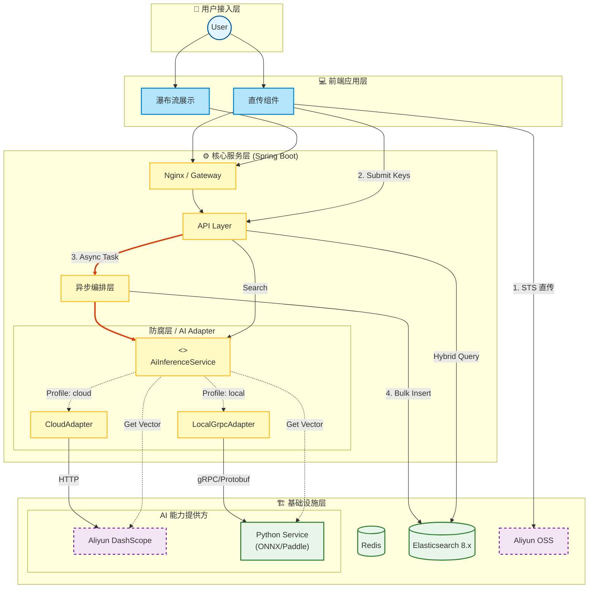
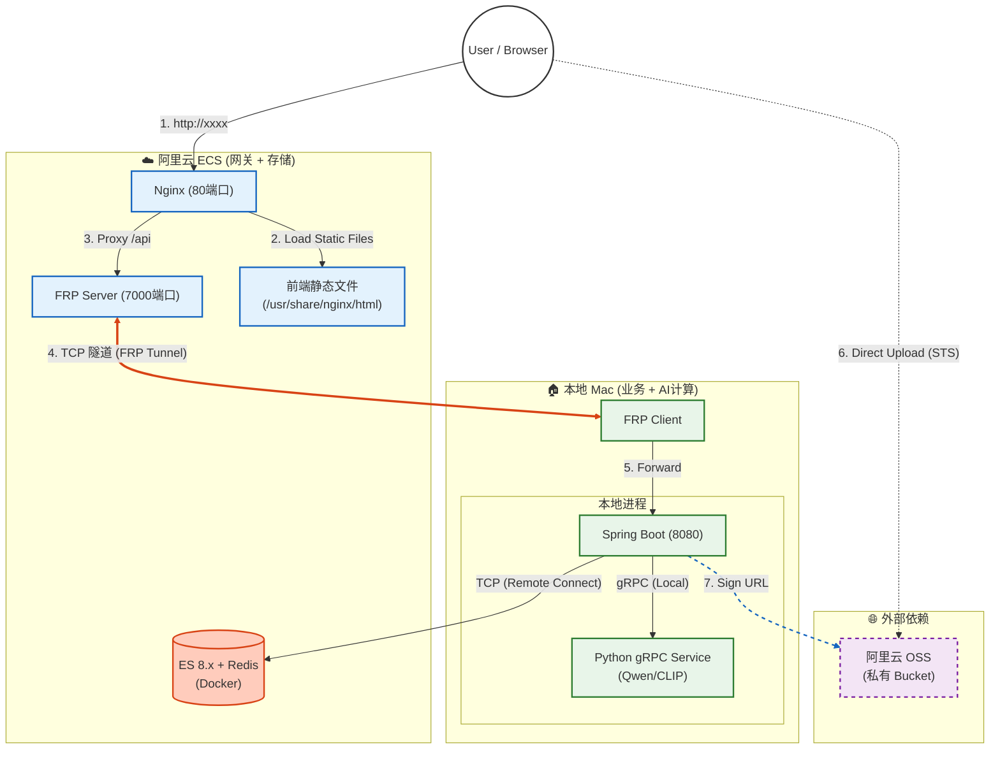

# 🌌 SmartVision - 企业级多模态 RAG 检索引擎

[](https://openjdk.org/)
[](https://spring.io/projects/spring-boot)
[](https://www.elastic.co/)
[](https://grpc.io/)
[]()

> **SmartVision** 是一个基于 Java 生态 构建的企业级多模态搜索（Multimodal Search）解决方案参考实现。
>
> 本项目旨在验证在资源受限（如 2C2G 云服务器）与高性能需求并存的场景下，如何通过 **云边协同 (Cloud-Edge Synergy)** 架构，整合本地算力，构建高吞吐、低成本的非结构化数据处理中台。

---

## 📖 设计背景与问题定义 (Problem Statement)

在企业级数字资产管理（DAM）场景中，传统的搜索技术面临两极分化的困境：

1.  **语义鸿沟**：基于元数据（Tags）的检索无法响应“赛博朋克风格”、“构图宏大”等抽象描述；而纯向量检索在精确匹配（如OCR文字、ID）时表现不佳。
2.  **算力与成本悖论**：云端 AI API 调用成本高昂且受网络延迟影响；而本地部署大模型对服务器硬件要求极高，难以在低配云服务器上运行。

**SmartVision** 通过以下架构决策解决了上述痛点：
*   **混合召回**：融合 HNSW 向量检索与 BM25 文本检索，兼顾查全率与查准率。
*   **云边协同**：设计了 **策略路由 (Strategy Routing)** 机制，支持在“云端 SaaS 模式”与“本地 gRPC 推理模式”间无缝切换，实现低成本的高性能私有化部署。

---

## 🏗 系统架构 (System Architecture)

系统采用 **CQRS** 读写分离，并引入 **适配器模式 (Adapter Pattern)** 隔离底层 AI 推理实现。



---

## ⚡️ 核心特性 (Key Features)

### 1. 云边协同与多策略推理 (Cloud-Edge Synergy)
为了平衡开发便捷性与运行成本，系统内置了两套 AI 推理策略，通过 `Spring Profile` 一键切换：
*   **Cloud Mode (`dev`)**：调用阿里云 DashScope API (通义万相)。适合无显卡开发环境，开箱即用。
*   **Local Mode (`prod`)**：通过 **gRPC** 调用本地 Python 服务 (Chinese-CLIP + PaddleOCR)。适合高性能演示环境，数据不出内网，**0 Token 成本**。
    *   *部署技巧*：支持通过 **FRP 内网穿透** 将云端流量转发至本地高性能 Mac/GPU 服务器，实现“低配云服务器 + 高配本地算力”的混合部署。

### 2. 高性能混合检索 (Hybrid Retrieval)
摒弃单一检索模式，实现了基于 **得分对齐** 的混合召回：
*   **语义路**：利用 CLIP/Embedding 模型提取 768/1024 维视觉特征。
*   **词法路**：集成 OCR 提取文字，结合 ES 的 `ik_max_word` 分词。
*   **归一化**：通过分段线性插值算法，将 ES 原始异构分数归一化为用户可理解的 **0%~99%** 匹配置信度。

### 3. 零阻塞上传 (Zero-Blocking Upload)
针对 I/O 密集型的图片上传场景，采用 **Presigned URL (STS)** 模式：
*   **带宽卸载**：文件流直接走云厂商 CDN/内网节点，不占用应用服务器带宽。
*   **鲁棒性设计**：前端配合状态机，支持断点续传与失败重试。

### 4. 性能优化体系
*   **OSS 动态压缩**：利用 OSS-IP 动态调整图片尺寸与质量，AI 分析时传输体积减少 **80%+**。
*   **语义缓存**：Redis 缓存高频查询向量，热词响应时间降级至 **~20ms**。

---

## 📊 基准测试 (Benchmark)

基于 **Local Mode (Mac M1, gRPC, ONNX Runtime)** 的实测数据：

| 场景 | 策略 | 平均耗时 | 成本 |
| :--- | :--- | :--- | :--- |
| **图片向量化** | Aliyun HTTP API | ~450ms | ¥0.02 / 次 |
| **图片向量化** | **Local ONNX (CPU)** | **~40ms** | **¥0.00** |
| **OCR 提取** | Aliyun HTTP API | ~800ms | ¥0.05 / 次 |
| **OCR 提取** | **Local PaddleOCR** | **~150ms** | **¥0.00** |

> **结论**：在本地 gRPC 模式下，推理速度提升了 **10倍+**，且实现了完全的零边际成本。

---

## 🛠 技术栈 (Tech Stack)

| 领域 | 技术组件 | 说明 |
| :--- | :--- | :--- |
| **Backend** | Java 21, Spring Boot 3.3 | 核心业务逻辑 |
| **RPC** | **gRPC, Protobuf** | 跨语言高性能通信 |
| **AI Serving** | Python 3.10, ONNX Runtime | 本地推理服务 (Chinese-CLIP, PaddleOCR) |
| **Search** | Elasticsearch 8.11 | HNSW 向量索引 + BM25 |
| **SaaS** | Aliyun DashScope / OSS | 云端兜底方案 |
---

## 📂 项目结构 (Structure)

```text
com.smart.vision.core
├── ai                      // AI 模型服务 (Embedding, OCR)
├── annotation              // 注解类
├── builder                 // 构建器
├── component               // 通用组件
├── config                  // 基础设施配置 (ES, Async, Aliyun Clients)
├── constant                // 全局常量
├── controller              // 接入层 (REST API)
├── exception               // 异常类
├── interceptor             // 拦截器
├── manager                 // 防腐层 (ACL) - 封装外部 SDK (Aliyun, OSS)
├── model                   // 领域模型与数据传输对象
│   ├── dto                 // 数据传输对象 (Request/Response)
│   ├── entity              // 数据库实体 (Elasticsearch Document)
│   └── enums               // 枚举 (SearchType, ErrorCode)
├── processor               // 处理器
├── query                   // 查询层
├── repository              // 持久层 (Elasticsearch Repository)
├── service                 // 核心业务逻辑层
│   ├── convert             // 模型转换
│   ├── ingestion           // 数据入库业务 (上传流水线)
│   └── search              // 检索业务 (策略模式)
├── strategy                // 策略层 (定义不同的召回策略)
└── util                    // 工具类
```

---
## ⚙️ 部署图(Deployment Diagram)



---

## 🚀 快速开始 (Quick Start)

### 1. 环境准备
*   **Java**: JDK 21+
*   **Python**: 3.10+ (仅 Local 模式需要)
*   **Docker**: 运行 ES 和 Redis

### 2. 启动模式选择

#### 🅰️ 模式 A：云端模型模式
仅依赖阿里云 API，无需配置 Python 环境。
```bash
# application.yml
spring.profiles.active: cloud
```

#### 🅱️ 模式 B：本地模型模式
启动 Python gRPC 服务，享受极速推理。
```bash
# 1. 启动 Python 服务
cd smart-vision-python
python model_server.py

# 2. 启动 Java 后端
# application.yml
spring.profiles.active: local
```

---

## 🛣 路线图 (Roadmap)

- [x] 基础直传与向量入库流程
- [x] 混合检索策略 (Vector + Keyword)
- [x] **异构微服务拆分 (Java + Python gRPC)**
- [x] Redis 语义缓存
- [ ] **视频模态支持**：增加关键帧提取与视频片段检索
- [ ] **知识图谱融合**：提取图片实体构建轻量级 SPO 图谱

