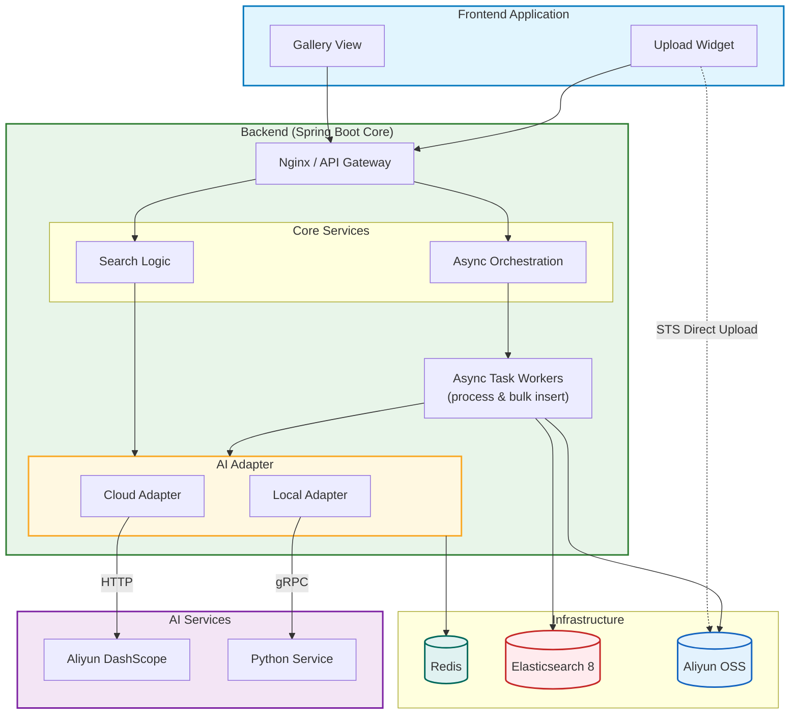
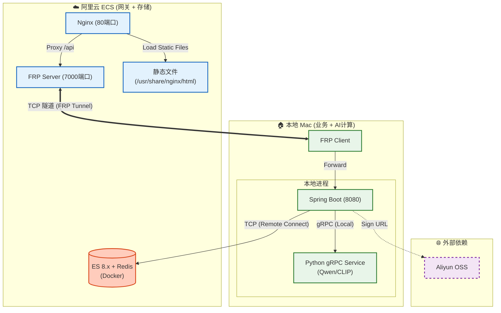

# 🌌 SmartVision - 企业级多模态 RAG 检索引擎

[](https://openjdk.org/)
[](https://spring.io/projects/spring-boot)
[](https://www.elastic.co/)
[](https://grpc.io/)
[]()

> **SmartVision** 是一个基于 Java 生态 构建的企业级多模态搜索（Multimodal Search）解决方案参考实现。
---

## 🏗 系统架构 (System Architecture)

系统采用 **CQRS** 读写分离，引入 **适配器模式 (Adapter Pattern)** 隔离底层 AI 推理实现。
(GitHub dark主题下显示效果存在问题)

```mermaid
graph TD
    %% Styles
    classDef front fill:#E1F5FE,stroke:#0277BD,stroke-width:2px;
    classDef back fill:#E8F5E9,stroke:#2E7D32,stroke-width:2px;
    classDef ai fill:#F3E5F5,stroke:#7B1FA2,stroke-width:2px;
    classDef infra fill:#fff,stroke:#333,stroke-width:2px,stroke-dasharray: 5 5;
    classDef db fill:#FFEBEE,stroke:#C62828,stroke-width:2px;
    classDef redis fill:#E0F2F1,stroke:#00695C,stroke-width:2px;
    classDef oss fill:#E3F2FD,stroke:#1565C0,stroke-width:2px;
    classDef yellow fill:#FFF8E1,stroke:#F9A825,stroke-width:2px;

    %% Layout
    subgraph Frontend_Layer [Frontend Application]
        direction LR
        Waterfall[Gallery View]
        Upload[Upload Widget]
    end

    subgraph Backend_Layer ["Backend (Spring Boot Core)"]
        direction TB
        Gateway[Nginx / API Gateway]
        
        subgraph Logic [Core Services]
            Orchestration[Async Orchestration]
            SearchLogic[Search Logic]
        end

        Worker["Async Task Workers<br>(process & bulk insert)"]
        
        subgraph Adapter [AI Adapter]
            CloudAdapt[Cloud Adapter]
            LocalAdapt[Local Adapter]
        end
    end

    subgraph AI_Layer [AI Services]
        DashScope["Aliyun DashScope"]
        PythonSvc["Python Service"]
    end

    subgraph Infra_Layer [Infrastructure]
        Redis[(Redis)]
        ES[(Elasticsearch 8)]
        OSS[(Aliyun OSS)]
    end

    %% Connections
    Waterfall --> Gateway
    Upload --> Gateway
    Upload -.->|STS Direct Upload| OSS

    Gateway --> Orchestration
    Gateway --> SearchLogic
    
    Orchestration --> Worker
    SearchLogic --> Adapter
    Worker --> Adapter

    CloudAdapt -->|HTTP| DashScope
    LocalAdapt -->|gRPC| PythonSvc

    Adapter --> Redis
    Worker --> ES
    Worker --> OSS

    %% Apply Styles
    class Frontend_Layer front
    class Backend_Layer back
    class AI_Layer ai
    class Adapter yellow
    class Redis redis
    class ES db
    class OSS oss
```

---

## ⚡️ 核心特性 (Key Features)

### 1. 云边协同 (Cloud-Edge Synergy)
系统内置了两套 AI 推理策略，通过 `Spring Profile` 一键切换：
*   **Cloud Mode**：调用阿里云 DashScope API (通义万相)。适合无显卡开发环境，开箱即用。
*   **Local Mode**：通过 **gRPC** 调用本地 Python 服务 (CLIP + PaddleOCR + LMM)。适合高密级数据场景，数据不出内网，0 Token 成本。
    *   *部署技巧*：支持通过 **FRP 内网穿透** 将云端流量转发至本地高性能 Mac/GPU 服务器，实现“低配云服务器 + 高配本地算力”的混合部署。

### 2. 混合检索 (Hybrid Retrieval)
通过BM25+ HNSW，实现了基于得分对齐的混合召回：
*   **语义路**：利用 CLIP和类CLIP (阿里云的multimodal-embedding) 模型提取文本/图片向量。
*   **词法路**：集成 OCR 提取文字，结合 ES 的 `ik_max_word` 分词。
*   **归一化**：通过分段线性插值算法，将 ES 原始异构分数归一化为用户可理解的 **0%~99%** 匹配度。

### 3. 零阻塞上传 (Zero-Blocking Upload)
针对 I/O 密集型的图片上传场景，采用 **Presigned URL (STS)** 模式：
*   **带宽卸载**：文件流直接走云厂商 CDN/内网节点，不占用应用服务器带宽。
*   **鲁棒性设计**：前端配合状态机，支持断点续传与失败重试。

### 4. 性能优化体系
*   **OSS 动态压缩**：利用 OSS-IP 动态调整图片尺寸与质量，AI 分析时传输体积减少 **80%+**。
*   **语义缓存**：Redis 缓存高频查询向量，热词响应时间降级至 **~20ms**。

---

## 📊 基准测试 (Benchmark)
### 1. 测试环境 (Test Environment)
*   **服务器**: 阿里云 ECS (2 vCPU, 2GB RAM)
*   **数据库**: Elasticsearch 8.11 (单节点, 1GB Heap), Redis 7.0
*   **网络**: 公网带宽 5Mbps
*   **数据集**: [Unsplash Lite Dataset](https://unsplash.com/data) (随机抽取 1,000 张图片, 平均大小 2.5MB)

### 2. 写入性能对比 (Ingestion Performance)
> 测试场景：批量上传 50 张图片并完成入库（含 OSS 上传、AI 向量化、OCR 提取、ES 写入）。

| 模式 | 并发策略 | 平均耗时 (Total) | 单图平均耗时 | 吞吐量 (QPS) | 提升倍数       |
| :--- | :--- | :--- | :--- | :--- |:-----------|
| **串行处理** | 单线程 Loop | 115.0s | 2300ms | 0.43 | 1x   |
| **并行编排** | `CompletableFuture` (10线程) | **18.5s** | **370ms** | **2.70** | **6.2x** |


### 3. 搜索延迟对比 (Search Latency)
> 测试场景：针对高频热词（如 "橘猫"）进行 100 次连续查询，计算 TP99 延迟。

| 场景 | 缓存策略 | Embedding 耗时 | ES 检索耗时 | TP99 总耗时 | 优化效果    |
| :--- | :--- | :--- | :--- | :--- |:--------|
| **冷启动** | 无缓存 (Direct API) | 350ms - 600ms | 20ms | **580ms** | 1x      |
| **热查询** | **Redis 语义缓存** | **2ms** | 20ms | **28ms** | **20x** |


### 4. 存储与带宽优化 (Optimization)
利用 OSS 动态处理能力，在传输给 AI 模型前对图片进行实时压缩（Resize 2048px + Quality 80）。

| 指标 | 原始方案 (Original) | 优化方案 (Optimized) | 节省比例 |
| :--- | :--- | :--- | :--- |
| **平均传输体积** | 2.5 MB | 0.35 MB | **86%** |
| **AI 下载耗时** | ~800ms | ~150ms | **81%** |
| **向量精度损耗** | 0% | < 0.5% (可忽略) | - |

---

## 🛠 技术栈 (Tech Stack)

| 领域             | 技术组件                   | 说明                            |
|:---------------|:-----------------------|:------------------------------|
| **Backend**    | Java 21, Spring Boot 3 | 核心业务逻辑                        |
| **RPC**        | **gRPC, Protobuf**     | 跨语言高性能通信                      |
| **AI Service** | Python 3               | 本地推理服务 (CLIP, PaddleOCR, LMM) |
| **Search**     | Elasticsearch 8.11     | HNSW 向量索引 + BM25              |
| **SaaS**       | Aliyun DashScope / OSS | 云端能力提供方                       |
---

## 📂 项目结构 (Structure)

```text
com.smart.vision.core
├── ai                      // 模型相关类
├── annotation              // 注解类
├── component               // 通用组件
├── config                  // 基础设施配置 (ES, Async, Aliyun Clients)
├── constant                // 全局常量
├── controller              // 接入层 (REST API)
├── convertor               // 转换器
├── exception               // 异常类
├── interceptor             // 拦截器
├── manager                 // 防腐层 (ACL) - 封装外部 SDK (Aliyun, OSS)
├── model                   // 领域模型与数据传输对象
│   ├── dto                 // 数据传输对象 (Request/Response)
│   ├── entity              // 数据库实体 (Elasticsearch Document)
│   └── enums               // 枚举 (SearchType, ErrorCode)
├── processor               // 查询处理类
├── query                   // 查询类 (定义不同的查询策略)
├── repository              // 持久层 (Elasticsearch Repository)
├── service                 // 核心业务逻辑层
│   ├── convert             // 模型转换
│   ├── ingestion           // 数据入库业务 (上传流水线)
│   └── search              // 检索业务 (策略模式)
├── strategy                // 策略层 (定义不同的召回策略)
├── task                    // 任务类
└── util                    // 工具类
```

---
## ⚙️ 部署图(Deployment Diagram)
(GitHub dark主题下显示效果存在问题)

```mermaid
graph TD
    %% ================= 样式定义 =================
    classDef user fill:#ffffff,stroke:#333,stroke-width:2px;
    classDef cloud fill:#e3f2fd,stroke:#1565c0,stroke-width:2px;
    classDef edge fill:#e8f5e9,stroke:#2e7d32,stroke-width:2px;
    classDef saas fill:#f3e5f5,stroke:#7b1fa2,stroke-width:2px,stroke-dasharray: 5 5;
    classDef db fill:#ffccbc,stroke:#d84315,stroke-width:2px;

    %% ================= 云端节点 (流量入口 + 数据中心) =================
    subgraph Cloud_Node ["☁️ 阿里云 ECS (网关 + 存储)"]
        direction TB
        Nginx["Nginx (80端口)"]:::cloud
        FRPS["FRP Server (7000端口)"]:::cloud
        StaticFiles["静态文件<br>(/usr/share/nginx/html)"]:::cloud
        DB[("ES 8.x + Redis<br>(Docker)")]:::db
    end

    %% ================= 边缘节点 (算力核心) =================
    subgraph Edge_Node ["🏠 本地 Mac (业务 + AI计算)"]
        direction TB
        FRPC[FRP Client]:::edge
        
        subgraph Local_Compute [本地进程]
            Java["Spring Boot (8080)"]:::edge
            Python["Python gRPC Service<br>(Qwen/CLIP)"]:::edge
        end
    end

    %% ================= 外部 SaaS =================
    subgraph External_SaaS [🌐 外部依赖]
        OSS["Aliyun OSS"]:::saas
    end

    %% ================= 流量链路 =================

    Nginx -- "Load Static Files" --> StaticFiles

    Nginx -- "Proxy /api" --> FRPS
    FRPS <== "TCP 隧道 (FRP Tunnel)" ==> FRPC
    FRPC -- "Forward" --> Java

    Java -- "gRPC (Local)" --> Python
    Java -- "TCP (Remote Connect)" --> DB

    Java -.->|"Sign URL"| OSS

```

---

## 🚀 快速开始 (Quick Start)

### 1. 前置要求
*   **JDK 21+**
*   **Docker & Docker Compose**: 运行ES和Redis
*   **阿里云账号**：需开通 OSS 服务及 DashScope (百炼) 模型服务 API Key。
*   **Python3**: 仅 Local 模式需要

### 2.环境参数配置
根据.env.example 配置环境参数。

### 3. 启动模式选择

#### 🅰️ 模式 A：云端模型模式
仅依赖阿里云 API，无需配置 Python 环境。
```bash
# application.yml
spring.profiles.active: cloud
```

#### 🅱️ 模式 B：本地模型模式
启动 Python gRPC 服务
```bash
# 1. 启动 Python 服务
cd smart-vision-python
python server.py

# 2. 启动 Java 后端
# application.yml
spring.profiles.active: local
```

---

## 🛣 路线图 (Roadmap)

- [x] 基础直传与向量入库流程
- [x] 混合检索策略 (Vector + Keyword)
- [x] **异构微服务拆分 (Java + Python gRPC)**
- [x] Redis 语义缓存
- [x] **知识图谱融合**：提取图片实体构建轻量级 SPO 图谱
- [ ] **视频模态支持**：增加关键帧提取与视频片段检索

