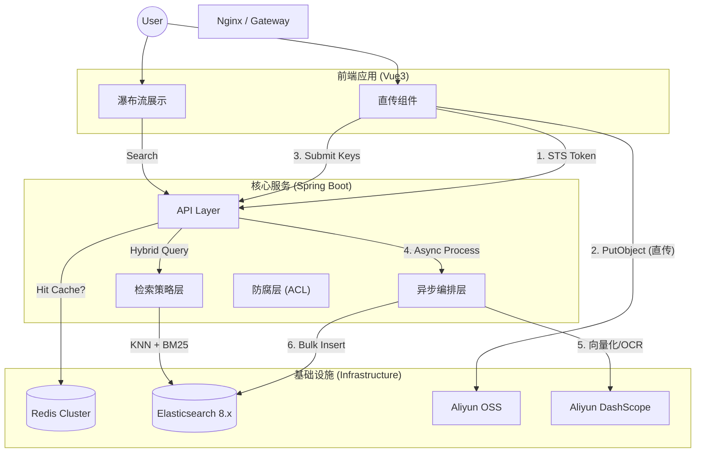

# 🌌 SmartVision - 企业级多模态 RAG 检索引擎

[](https://openjdk.org/)
[](https://spring.io/projects/spring-boot)
[](https://www.elastic.co/)
[](#)

> **SmartVision** 是一个验证 **"Java + AI"** 在企业级搜索场景落地可能性的工程实践项目。
> 它不仅仅是一个“以文搜图”的 Demo，更是一套针对 **海量非结构化数据** 处理的 **高吞吐、低延迟、高可用** 解决方案。

---

## 📖 项目背景与设计初衷 (Design Philosophy)

在传统的电商商品库或企业素材库中，搜索体验往往存在两个极端：
1.  **基于关键词（Tags）**：检索精准，但依赖人工打标，维护成本极高，且无法覆盖“复古风”、“构图宏大”等长尾语义。
2.  **纯向量检索（Pure Vector）**：能理解语义，但在搜具体 ID、文字（OCR）时准确率极差，且存在“幻觉”召回。

**SmartVision** 不仅仅是一个“以文搜图”的 Demo，更是针对 **Java 技术栈在 AI 工程化落地** 的一次完整实践。验证在不引入庞大的 Python 微服务体系下，如何利用 Spring Boot + ES 8 构建一个**既懂语义、又懂关键词**的生产级搜索中台。

在设计过程中，重点解决了以下**真实场景下的工程痛点**：
*   **网络 I/O**：海量图片上传如何不阻塞后端核心线程？
*   **成本控制**：如何降低昂贵的 AI Token 消耗和 OSS 存储成本？
*   **召回质量**：如何在没有人工标签的情况下，保证搜索的查全率与查准率？


---

## 🏗 系统架构 (System Architecture)

IO 与逻辑的读写分离 (CQRS)：
写链路：采用 客户端直传 OSS 方案，将重 IO 的图片上传流量与后端逻辑剥离；后端采用 异步流水线 处理数据入库，确保写入高负载不阻塞读取请求。
读链路：搜索请求独立处理，配合 Redis 语义缓存，保证毫秒级查询响应。



---

## ⚡️ 核心技术亮点 (Key Features)

#### 1. 生产级的“混合召回”策略 (Hybrid Retrieval Strategy)
单纯的 HNSW 向量检索在实际业务中往往不够用。本项目制定了一套**多路召回 + 动态加权**的策略：
*   **语义路 (Semantic Path)**：利用 `multimodal-embedding-v1` 模型提取 1024 维视觉特征，解决“搜感觉、搜风格”的问题。
*   **文本路 (Lexical Path)**：集成 OCR 提取图片文字，结合 ES 的 `match_phrase` 和 `standard` 分词器，解决“搜发票号、搜广告语”的问题。
*   **排序逻辑**：通过自定义评分公式（`Vector_Score * 0.9 + BM25_Score * 0.5`），在保留语义相关性的同时，让包含精准关键词的结果置顶。

#### 2. “零阻塞”上传架构 (Zero-Blocking Upload)
针对图片上传这种 **I/O 密集型** 任务，摒弃了传统的“前端->后端->OSS”的数据流链路，改为 **客户端直传 (STS)** 模式：
*   **带宽卸载**：文件流直接走阿里云内网/CDN 节点，后端服务仅负责权限签发，网卡流量几乎为零。
*   **状态机管理**：前端配合实现了由 `Ready` -> `Uploading` -> `Processing` -> `Finish` 组成的完整状态机，即使网络波动导致 OSS 上传部分失败，也能针对单个文件进行断点重试，保证数据最终一致性。

#### 3. AI 成本与延迟的极致优化
AI 服务（Embedding）通常是系统中最大的**耗时瓶颈**和**成本中心**。本项目引入了多级优化手段：
*   **OSS-IP 前置处理**：在图片送入 AI 模型前，利用 OSS 自身的图像处理能力进行**在线压缩（Resize/Format/Quality）**。实测将 10MB 的原图压缩至 500KB 喂给 AI，在不损失向量精度的前提下，将 AI 服务的 I/O 耗时降低了 **80%**。
*   **语义缓存 (Semantic Cache)**：在 Service 层引入 Redis，对高频搜索词的向量结果进行缓存（TTL 24h）。对于热点词汇（如“红色跑车”），系统响应时间从 500ms 骤降至 **20ms**，大幅减少了 Token 开销。

#### 4. 数据丰满化与分面筛选 (Data Enrichment & Faceting)
单纯的向量检索难以满足“只看卡通风格”或“只找户外场景”这类结构化筛选需求。
*   **多模态理解**：在入库流水线中引入 **Qwen-VL** 视觉大模型，对图片进行深度语义理解，自动生成“风格”、“场景”、“主体”等结构化标签。
*   **结构化落地**：将 LLM 生成的非结构化描述清洗为 JSON 数组，存入 Elasticsearch 的 `tags` 字段。这使得系统不仅支持模糊的语义搜图，还能支持精确的 **分面搜索 (Faceted Search)** 和统计分析，填补了向量检索在精确过滤上的短板。

---

## 🛠 技术栈清单

*   **Language**: Java 21 
*   **Framework**: Spring Boot 3.5.8
*   **Search Engine**: Elasticsearch 8.18.8 (HNSW + BM25)
*   **AI Model**: Aliyun DashScope (通义万相 Embedding / 通义千问 OCR)
*   **Storage**: Aliyun OSS (Object Storage Service)
*   **Cache**: Redis 7.x
*   **Frontend**: Vue 3 + Vite + Element Plus 

---

## 🚀 快速启动 (Quick Start)

### 1. 环境要求
*   JDK 21+
*   Docker & Docker Compose
*   阿里云账号 (开通 OSS 和 百炼服务)

### 2. 启动中间件
```bash
# 启动 ES 和 Redis (开发模式)
docker run -d -p 9200:9200 -e "discovery.type=single-node" -e "xpack.security.enabled=false" elasticsearch:8.11.3
docker run -d -p 6379:6379 redis:latest
```

### 3. 配置参数
复制 `.env.example` 为 `.env` 或在 IDE 中配置环境变量：
```properties
ALIYUN_ACCESS_KEY_ID=your_ak
ALIYUN_ACCESS_KEY_SECRET=your_sk
DASHSCOPE_API_KEY=sk-your_api_key
```

### 4. 启动服务
```bash
# 后端
./mvnw spring-boot:run

# 前端
cd smart-vision-web
npm install && npm run dev
```

---

## 👨‍💻 作者信息

**Ryan** - *30岁，依然热爱代码的工程师*

此项目展示了我对 **微服务架构、高并发处理、以及 AI 工程化落地** 的理解。欢迎 Issue 交流。

---

### 📄 License

Apache License 2.0
