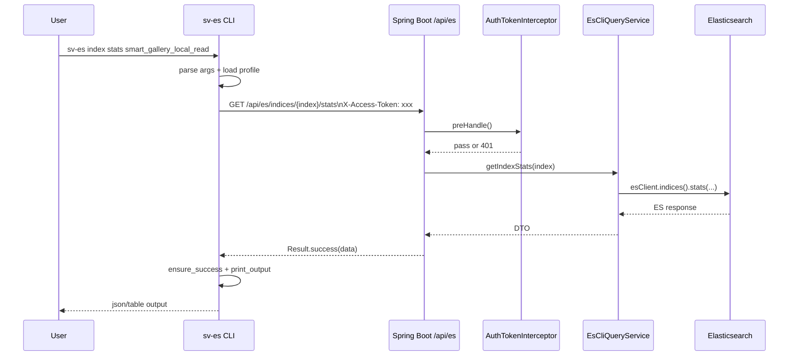

# ES CLI 请求链路说明（命令行 -> REST -> Elasticsearch）

更新时间：2026-04-10

## 1. 总览

当你在终端执行 `sv-es ...`（或 `scripts/sv-es ...`）时，内部链路是：

1. CLI 解析命令和参数（`--profile`、`--base-url`、`--token`、子命令参数）。
2. CLI 从本地 profile 读取登录信息（若未显式传参）。
3. CLI 将子命令映射为后端 `/api/es/**` REST 路径并发起 HTTP 请求。
4. 后端鉴权拦截器校验 `X-Access-Token`。
5. `EsCliController` 路由到 `EsCliQueryService`。
6. `EsCliQueryService` 调用 Elasticsearch Java Client 执行查询。
7. 后端返回统一 `Result<T>`，CLI 做错误处理与格式化输出（json/table）。

## 2. 时序图



## 3. 关键代码位置

脚本版 CLI（当前仓库可直接运行）：

- 参数解析与命令分发：`scripts/sv-es`（`while/case`）
- HTTP 请求封装：`request()`（`curl` + `X-Access-Token`）
- 成功/失败处理：`ensure_success()`、`map_error_hint()`
- 输出渲染：`print_output()`、`render_table()`

后端 REST：

- 路由入口：`src/main/java/com/smart/vision/core/search/escli/interfaces/rest/EsCliController.java`
- 鉴权注解：`@RequireAuth`（所有 `/api/es/**` 方法）
- 鉴权拦截器：`src/main/java/com/smart/vision/core/common/security/AuthTokenInterceptor.java`
- 拦截器注册：`src/main/java/com/smart/vision/core/common/config/WebMvcConfig.java`

后端 ES 查询实现：

- 服务实现：`src/main/java/com/smart/vision/core/search/escli/application/EsCliQueryService.java`
- 示例：
  - `cluster health` -> `getClusterHealth()`
  - `index stats` -> `getIndexStats()`
  - `doc search` -> `searchDocuments()`

## 4. 以 `doc search` 为例的请求映射

命令：

```bash
scripts/sv-es --profile local doc search smart_gallery_cloud_read --q 'fileName:猫' --size 5
```

CLI 组装的 REST 请求：

```http
POST /api/es/indices/smart_gallery_cloud_read/search
X-Access-Token: <from profile or --token>
Content-Type: application/json

{
  "query": "fileName:猫",
  "from": 0,
  "size": 5,
  "sort": [],
  "sourceIncludes": []
}
```

后端处理后返回：

- `code=200`：返回命中文档（默认排除 `imageEmbedding` 向量字段）。
- `code!=200`：返回统一错误码，CLI 会附带 hint 并以非 0 退出。

## 5. 常见排障点

1. 401：token 失效或未携带，重新 `login`。
2. 403：索引未在白名单，检查 `app.search.escli.allowed-index-patterns`。
3. 400：query/sort/size 不合法，按错误 hint 调整参数。
4. 500：后端或 ES 故障，查看服务日志和 `escli_audit`。
